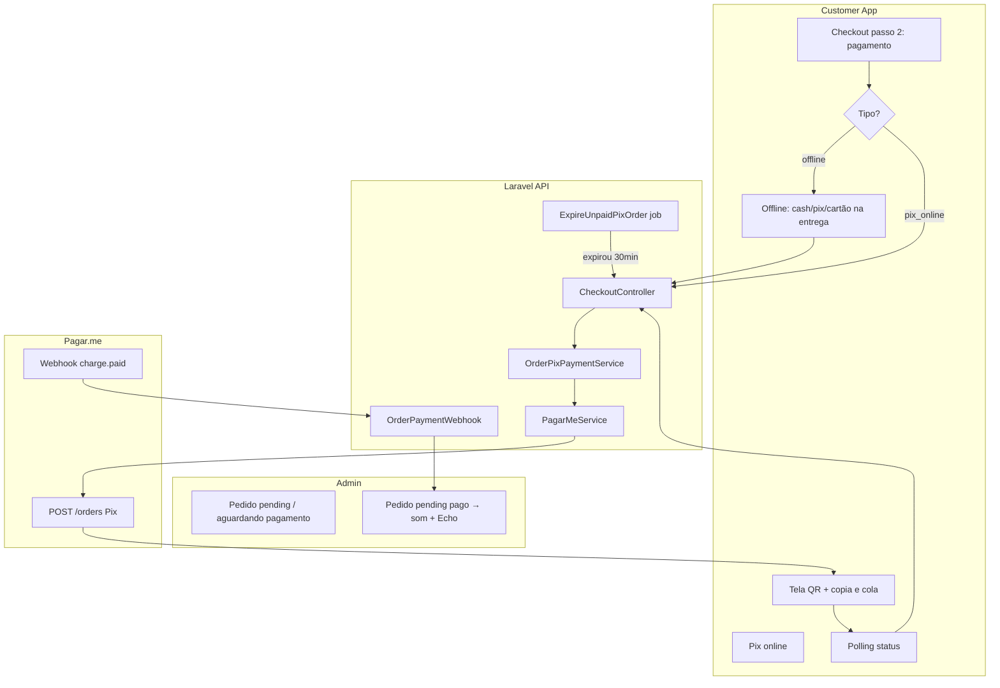

# Pagamento online no customer-app

Especificação técnica — jun/2026. Modelo alinhado a **Anota AI, Goomer, Consumer** (cardápio direto), não marketplace (iFood).

## Objetivo

Permitir que o cliente **pague no checkout** (Pix online na v1; cartão na v2), com confirmação automática do pedido após aprovação do gateway. Formas **na entrega/retirada** continuam como hoje.

## Hoje vs. alvo

| | Hoje | Alvo (v1 Pix) |
|---|------|----------------|
| Pix | Intenção — paga na entrega | Opção **Pix online** com QR/copia e cola |
| Pedido criado | Imediato + notifica loja | Pix online: só notifica loja **após pagamento** |
| Gateway | Pagar.me só para assinatura Pro | Pagar.me também para pedidos |
| Dinheiro | Lojista recebe offline | Cai na conta Pagar.me configurada |

## Arquitetura



## Formas de pagamento

| Chave API | Label UI | Canal | v1 |
|-----------|----------|-------|-----|
| `pix` | Pix na entrega | offline | ✅ já existe |
| `cash` | Dinheiro | offline | ✅ |
| `debit_card` | Débito na entrega | offline | ✅ |
| `credit_card` | Crédito na entrega | offline | ✅ |
| `pix_online` | Pix online | online | 🎯 v1 |
| `credit_card_online` | Cartão online | online | v2 |

Loja controla via `accepted_payment_methods` + flag `online_payments_enabled`.

## Modelo de dados

### `stores` (novos campos)

| Coluna | Tipo | Descrição |
|--------|------|-----------|
| `online_payments_enabled` | bool | Master switch Pix online |
| `pagarme_recipient_id` | string nullable | Recebedor da loja (split v2); v1 usa conta plataforma |

### `orders` (novos campos)

| Coluna | Tipo | Descrição |
|--------|------|-----------|
| `payment_status` | enum | `not_required`, `awaiting_payment`, `paid`, `failed`, `expired`, `refunded` |
| `payment_channel` | enum | `offline`, `online` |
| `pagarme_order_id` | string nullable | ID do order no Pagar.me |
| `pagarme_charge_id` | string nullable | ID da charge |
| `pix_qr_code` | text nullable | Copia e cola |
| `pix_qr_code_url` | string nullable | URL da imagem QR |
| `payment_expires_at` | timestamp nullable | Expiração do Pix |
| `payment_paid_at` | timestamp nullable | Quando confirmou |

### Regras de status do pedido

- **Offline:** `status=pending`, `payment_status=not_required` → `NewOrderPlaced` imediato (como hoje).
- **Pix online:** `status=pending`, `payment_status=awaiting_payment` → **não** dispara `NewOrderPlaced` até `payment_status=paid`.
- Após pagamento: `payment_status=paid`, dispara `NewOrderPlaced` + WhatsApp automático (se configurado).
- Expirou sem pagar: `payment_status=expired`, `status=canceled` (job agendado).

## API

### Criar pedido (alteração)

`POST /api/v1/checkout/orders`

```json
{
  "payment_method": "pix_online",
  "...": "demais campos iguais"
}
```

**Resposta extra quando `pix_online`:**

```json
{
  "order": { "id": 123, "payment_status": "awaiting_payment", ... },
  "payment": {
    "method": "pix_online",
    "status": "awaiting_payment",
    "amount": 45.90,
    "expires_at": "2026-06-15T20:30:00-03:00",
    "pix": {
      "qr_code": "00020126...",
      "qr_code_url": "https://..."
    }
  },
  "whatsapp_url": null
}
```

WhatsApp **não** abre antes do pagamento (evita pedido fantasma).

### Consultar pagamento (polling)

`GET /api/v1/checkout/orders/{order}/payment`

Query opcional: `phone=5511999998888` (validação — só quem fez o pedido consulta).

```json
{
  "payment_status": "paid",
  "order_status": "pending",
  "paid_at": "2026-06-15T20:05:00-03:00"
}
```

Throttle: 30 req/min por IP.

### Webhook Pagar.me

Estender `POST /api/v1/billing/pagarme/webhook` para rotear:

| Evento | Ação |
|--------|------|
| `subscription.*` | Fluxo atual (assinatura Pro) |
| `order.paid`, `charge.paid` | `OrderPixPaymentService::markPaid()` |
| `order.payment_failed`, `charge.payment_failed` | `payment_status=failed` |
| `order.canceled` | `payment_status=expired` |

Metadata obrigatória na charge:

```json
{
  "metadata": {
    "type": "order_payment",
    "order_id": "123",
    "store_id": "45"
  }
}
```

## Pagar.me — criação Pix (v5)

`OrderPixPaymentService` chama `POST /orders`:

```json
{
  "customer": {
    "name": "Cliente",
    "phones": { "mobile_phone": { "country_code": "55", "area_code": "11", "number": "999998888" } }
  },
  "items": [{
    "amount": 4590,
    "description": "Pedido #42 - Nome da Loja",
    "quantity": 1,
    "code": "order_123"
  }],
  "payments": [{
    "payment_method": "pix",
    "pix": { "expires_in": 1800 }
  }],
  "metadata": {
    "type": "order_payment",
    "order_id": "123",
    "store_id": "45"
  }
}
```

Resposta: extrair `charges[0].id`, `charges[0].last_transaction.qr_code`, `qr_code_url`, `expires_at`.

Config em `config/payments.php`:

- `pix_expires_in` — default 1800 (30 min)
- `pix_polling_interval_ms` — 3000 (front)
- `unpaid_order_ttl_minutes` — 30 (job)

## UI — Checkout (customer-app)

### Passo 2 — Pagamento

Separar visualmente:

```
┌─────────────────────────────────┐
│  Pagar agora                    │
│  ○ Pix online  (QR na hora)     │  ← novo
│                                 │
│  Pagar na entrega / retirada    │
│  ○ Pix                          │
│  ○ Dinheiro                     │
│  ○ Cartão débito                │
│  ○ Cartão crédito               │
└─────────────────────────────────┘
```

### Passo 3 — Pix online (substitui confirmação até pagar)

```
┌─────────────────────────────────┐
│  Pague R$ 45,90 para confirmar  │
│  [QR CODE]                      │
│  [Copiar código Pix]            │
│  Expira em 29:45                │
│  ⏳ Aguardando pagamento...      │
└─────────────────────────────────┘
```

Após `paid`:

```
┌─────────────────────────────────┐
│  ✓ Pagamento confirmado!        │
│  Pedido #42 enviado à loja        │
│  [Abrir WhatsApp] (opcional)      │
└─────────────────────────────────┘
```

Componente sugerido: `PixPaymentStep.jsx`.

## UI — Admin

### Recebimentos (`/payments`)

- Status da conta (PartiuMenu / conectada / não configurada)
- Toggle **Pix online** + salvar
- Botão **Conectar minha conta Pagar.me** (quando `PAGARME_CONNECT_URL` existir)

### Loja (`StoreView`)

- Formas de pagamento na entrega/retirada
- Toggle Pix online (atalho) + link para Recebimentos
- Banner se Pix online ativo sem gateway configurado

### Pedidos (`OrdersView`)

- Badge **Aguardando Pix** quando `payment_status=awaiting_payment`
- Filtro opcional
- Não tocar som até pagamento confirmado

## Conta Pagar.me — decisão

### v1 — Conta plataforma (MVP)

- Usa `PAGARME_*` já configurado
- Dinheiro cai na conta PartiuMenu; repasse manual ou automático depois
- Implementação mais rápida

### v2 — Conta por lojista (paridade concorrentes)

- Lojista cadastra `pagarme_recipient_id` ou OAuth Pagar.me
- Split automático; PartiuMenu pode cobrar taxa via `split` rules
- Exige onboarding KYC por loja

**Recomendação:** v1 para validar demanda; v2 antes de escalar comercialmente.

## Segurança

- Webhook: validar `x-hub-signature-256` (já existe em `PagarMeService`)
- Polling: validar `customer_phone` do pedido
- Idempotência: `markPaid()` ignora se já `paid`
- Estoque/cupom: reservar no create; liberar se expirar (job)

## Fases de implementação

| Fase | Escopo | Esforço |
|------|--------|---------|
| **1** | Migration + `OrderPixPaymentService` + webhook + job expiração | 2–3 dias |
| **2** | CheckoutController + rotas + polling API | 1 dia |
| **3** | UI customer (`PixPaymentStep`) + métodos na loja | 1–2 dias |
| **4** | Admin: toggle Pix online + badge pedidos | 0.5 dia |
| **5** | Cartão online (token + charge) | 2–3 dias |
| **6** | Recipient por loja + split | 3–5 dias |

## Arquivos criados / a alterar

```
backend/
  config/payments.php                          ✅ criado
  database/migrations/..._online_payment...    ✅ criado
  app/Services/OrderPixPaymentService.php      ✅ criado
  app/Http/Controllers/Api/CheckoutPaymentController.php  ✅ criado
  app/Jobs/ExpireUnpaidPixOrder.php            ✅ criado
  app/Http/Controllers/Api/CheckoutController.php         ⏳ fase 2
  app/Http/Controllers/Api/BillingController.php          ⏳ rotear webhook
  app/Models/Order.php, Store.php                           ⏳ fillable/casts

customer-app/
  src/components/PixPaymentStep.jsx            ⏳ fase 3
  src/components/Checkout.jsx                   ⏳ fase 3

admin-dashboard/
  src/views/StoreView.vue                       ⏳ fase 4
  src/views/OrdersView.vue                      ⏳ fase 4
```

## Variáveis de ambiente

```env
# Já existem para assinatura — reutilizadas para pedidos na v1
PAGARME_PUBLIC_KEY=
PAGARME_SECRET_KEY=
PAGARME_WEBHOOK_URL=https://api.partiumenu.com.br/api/v1/billing/pagarme/webhook
PAGARME_WEBHOOK_SECRET=

# Novas (opcionais)
PAYMENTS_PIX_EXPIRES_IN=1800
PAYMENTS_UNPAID_TTL_MINUTES=30
```

## Testes manuais (sandbox)

1. Loja com `online_payments_enabled=true` e `pix_online` nos métodos aceitos
2. Checkout → Pix online → QR exibido
3. Pagar no app sandbox Pagar.me
4. Webhook → pedido `paid` → som no admin
5. Não pagar → após 30 min job cancela
